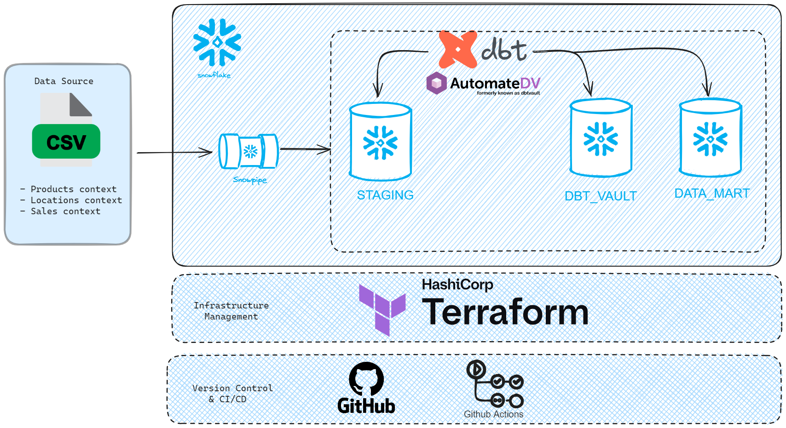

# Projet DataVault sur Snowflake

## Use Case V1 - Full Snowflake 
**Environnement technique**:  
- **Snowflake** : Cloud Data Platform  
- **SchemaChange** : Outil léger basé sur Python pour gérer les objets Snowflake  
- **Terraform** : Suivi des changements et gestion de l'infrastructure  (IaC)
- **GitHub** : Gestion de code source avec le control de versions en Git

---

## Use Case V2 - Snowflake XX dbt
**Architecture technique globale**:  

## Étape 0 : Les pré-requis d'installation
1. Installer **VS Code** en local  
2. Installer **Python** en local  
3. Installer **Ubuntu (WSL)** (pour l'usage de VS Code)  

---

## Étape 1 : Préparer l'environnement
- Avoir un compte **GitHub** pour forker (ou cloner) le projet [snowflake-demo](https://github.com/yassinedehbi/snowflake-demo)  
- Avoir un compte **Snowflake** 

### Pré-requis : 
- **Sources des datasets** :  
  - Récupérer les fichiers sources (.csv) localement et les mettre à disposition sur une plateforme de partage (ex. SharePoint ou plateforme interne).
- **Accès au repository GitHub** :  
  - Disposer des droits suffisants pour cloner le repository ou effectuer un fork.
- **Compte Terraform** :  
  - Avec création des workspaces pour les environnements (dev-test-prod)
- **Secrets pour Github Actions** :  
  - Configurer les secrets CI/CD nécessaires (informations de connexion au compte Snowflake et API token pour Terraform Cloud).

---

## Usage de Base : Consulter le projet
1. **Déployer le projet** : Cloner (ou forker) le repository GitHub.  
2. **Charger les données dans Snowflake** : Utiliser la commande `PUT` pour télécharger les fichiers `.csv` vers les stages. [exemple des scripts .sh](src/)
3. **Rafraîchir les données** : Exécuter `ALTER PIPE ... REFRESH` pour charger les nouveaux datasets pour chaque internal stage.
4. **Les pipelines de données tourneront pour alimenter les différents talbles/vues** 

---

## Usage Évolutif : Faire évoluer le projet
1. Créer une **nouvelle branche** sur GitHub.  
2. Apporter les **modifications souhaitées**.  
3. Effectuer des **tests localement**.  
4. Si les tests sont **OK** :  
   - Faire un **commit** et un **push** vers la branche sur GitHub.  
5. Créer une **Pull Request (PR)** :  
   - Compare la branche `main` à la nouvelle branche.
   - Déclenche les **tests automatisés** (CI).  
6. Si la PR est validée (**check OK**) :  
   - Effectuer un **merge** : cela déclenche la **CD** vers la base de données de test.

---
